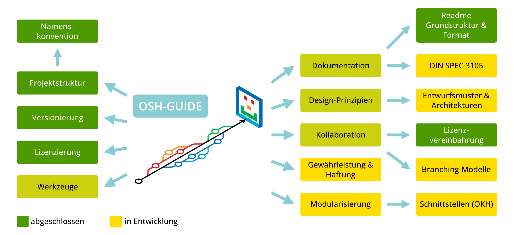

# Open Source Hardware Richtlinie

Wir versuchen mit dieser Richtlinie alle relevanten Aspekte bei der Open Source Hardware Entwicklung zu identifizieren und miteinander zu verknüpfen. Es gibt bereits sehr gute Empfehlungen, welche allerdings gerade Neulingen einen zu großen Raum an Freiheitsgraden lassen und diese mit der Frage "was am besten für sie passt" allein lassen. Diese Richtlinie beschreibt detailliert *einen* möglichen Weg um den Einstieg zu erleichtern.
Ziel ist es konkrete Empfehlungen bspw. zur Lizenzierung, Strukturierung, Versionierung oder Dokumentation von OSH-Projekten zu geben.

Diese Richtlinie wird im Rahmen des [OSHOP-Projekts](https://www.oshop-network.de/) der HTW Dresden entwickelt.

Es gibt eine Reihe bereits existierender Standards, die hier zur Anwendung kommen:

- `DIN EN 81346-1:2010-05`: "Industrielle Systeme, Anlagen und Ausrüstungen und Industrieprodukte – Strukturierungsprinzipien und Referenzkennzeichnung – Teil 1: Allgemeine Regeln (IEC 81346-1:2009)"
- `OSH-DIR-STD`: "OSH project directory structure standards"
    - <https://gitlab.fabcity.hamburg/software/template-osh-repo-structure-minimal/>
- `Semantic Versioning`: "Semantic Versioning 2.0.0", Versionierungsschema für aussagekräftige Versionsnummern zur Vermeidung von Abhängigkeitskonflikten
    - <https://semver.org/lang/de/>
- `ISO IEC 5692:2021 (SPDX)`: "System Package Data Exchange", Standard zur Lizenzierung offener und freier Software, Hardware, Daten oder Dokumentationen
    - <https://spdx.dev/>

## TODO

- Dokumentation:
    - Referenzierung der DIN SPEC 3105
        - <https://gitlab.com/OSEGermany/OHS-3105>
- Modularisierung und Verknüpfung (LinkedData):
    - Open Know How Meta Daten Standard referenzieren
        - <https://github.com/iop-alliance/OpenKnowHow>
- Entwurfsmuster und Architekturen für Maschinen und Geräte recherchieren bzw. adaptieren
- Branching-Modelle, z.B. für Varianten-Management, Merge-Strategien, etc.
- Gewährleistung und Haftung, Hinweise für die Dokumentation

## Konstruktionsrichtlinie

Das Repository wurde aufgeteilt in diesen öffentlichen OSH-Guide und Vorgaben für die mechanische Entwicklung (Mechanical-Rules).
Neben den allgemeinen Vorgaben zur Projektstrukturierung werden in der Konstruktionsrichtlinie weitere relevante Aspekte für die Konstruktion, sowie dem Einsatz von Robotern formuliert.

## Lizenz

Diese Richtlinie wird selbst unter der ``GPL-3.0-or-later`` lizenziert. Da sie nicht direkter Bestandteil einer Dokumentation eines OSH-Projekts ist, sondern ein eigenständiges Projekt darstellt ist die Anwendung der ``CERN-OHL-2.0`` hier u.U. irreführend. Die `GPL` wurde in der Vergangenheit auch für Texte angewendet.
