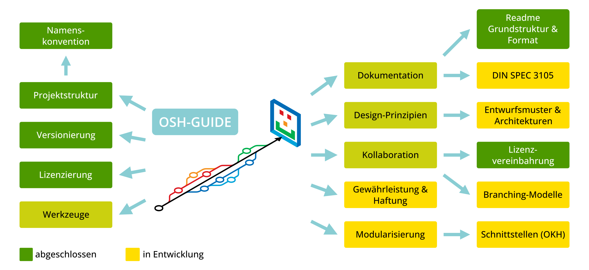

# Open Source Hardware Richtlinie

Wir versuchen mit dieser Richtlinie alle relevanten Aspekte bei der Open Source Hardware Entwicklung zu identifizieren und miteinander zu verknüpfen. Es gibt bereits sehr gute Empfehlungen, welche allerdings gerade Neulingen einen zu großen Raum an Freiheitsgraden lassen und diese mit der Frage "was am besten für sie passt" allein lassen. Diese Richtlinie beschreibt detailliert *einen* möglichen Weg um den Einstieg zu erleichtern.
Ziel ist es konkrete Empfehlungen bspw. zur Lizenzierung, Strukturierung, Versionierung oder Dokumentation von OSH-Projekten zu geben.




## Benutzung

Dieses Repository ist selbst nach den Empfehlungen dieses Guides aufgebaut.

Struktur:

```txt
├─┬ gen/                # Ordner für generierte abgeleitete Dokumente
│ └──osh-guide.pdf      # PDF-Version des Guides, Achtung: nicht aktuell! Soll 
                          künftig automatisiert werden.
├── mod/                # Submodule
├─┬ res/                # Ordner für sonstige Dokumente, welche sich noch in 
                          Bearbeitung befinden und noch nicht in den Guide 
                          aufgenommen wurden, sowie Bilder oder Videos
│ └── notes.md          # Notizen, Konzepte, Ideen
├─┬ src/
│ └── osh-guide.md      # Hauptdokument des Guides im Markdown-Format
├── LICENSE.txt
└── README.md
```


## Status

Diese Richtlinie wird im Rahmen des [OSHOP-Projekts](https://www.oshop-network.de/) der HTW Dresden aktiv entwickelt.


## Standards

Es gibt eine Reihe bereits existierender Standards, die hier zur Anwendung kommen:

- `DIN EN 81346-1:2010-05`: "Industrielle Systeme, Anlagen und Ausrüstungen und Industrieprodukte – Strukturierungsprinzipien und Referenzkennzeichnung – Teil 1: Allgemeine Regeln (IEC 81346-1:2009)"
- `OSH-DIR-STD`: "OSH project directory structure standards"
    - <https://gitlab.fabcity.hamburg/software/template-osh-repo-structure-minimal/>
- `Semantic Versioning`: "Semantic Versioning 2.0.0", Versionierungsschema für aussagekräftige Versionsnummern zur Vermeidung von Abhängigkeitskonflikten
    - <https://semver.org/lang/de/>
- `ISO IEC 5692:2021 (SPDX)`: "System Package Data Exchange", Standard zur Lizenzierung offener und freier Software, Hardware, Daten oder Dokumentationen
    - <https://spdx.dev/>


## OSH-Guidelines

Es gibt bereits eine Reihe von Guidelines, die die Entwicklung dieses OSH-Guides beeinflussten. Die Auswertung der einzelnen Guides ist allerdings noch nicht abgeschlossen. Diese Liste soll zunächst die verfügbaren Ressourcen bündeln.

- `Best Practices for Open Source Hardware`: <https://oshwa.org/resources/sharing-best-practices/>
- `Open-Documentation-Guide` des #ASKnet der r0g_agency: <https://github.com/opencultureagency/Open-Documentation-Guide>
- `Open-Hardware-Guide` des #ASKnet der r0g_agency: <https://github.com/opencultureagency/Open-Hardware-Guide>, <https://openculture.agency/outcomes/open-hardware-guide/>, <https://asknet.community/tools>
- `Hardware Documentation Guide`: <https://open-make.github.io/Hardware-template-guide/>
- Hardware Research Template: <https://codeberg.org/openmake/Hardware-template-guide>>
- `Open Hardware Design Guide`: <https://hardware.prototypefund.de/open-hardware-design-guide/>
- `How to Open Source Hardware` der Open Hardware Alliance: <https://open-hardware-allianz.de/oer.html>
- Open Hardware Promotional (Poster) der TU Delft: <https://gitlab.tudelft.nl/nemoandrea/poster-open-hardware>
- The Turing Way handbook to reproducible, ethical and collaborative data science/Open SOurce Hardware: <https://book.the-turing-way.org/reproducible-research/open/open-hardware>
- Best Practices for OSH-Projects des CERN Open Source Program Office: <https://ospo.docs.cern.ch/recommendations/hw-best-practices/>


## TODO

- Dokumentation:
    - Referenzierung der DIN SPEC 3105
        - <https://gitlab.com/OSEGermany/OHS-3105>
- Modularisierung und Verknüpfung (LinkedData):
    - Open Know How Meta Daten Standard referenzieren
        - <https://github.com/iop-alliance/OpenKnowHow>
- Entwurfsmuster und Architekturen für Maschinen und Geräte recherchieren bzw. adaptieren
- Branching-Modelle, z.B. für Varianten-Management, Merge-Strategien, etc.
- Gewährleistung und Haftung, Hinweise für die Dokumentation
- Namenskonvention erweitern
    - SPS
    - CAD


## Konstruktionsrichtlinie

Das Repository wurde aufgeteilt in diesen öffentlichen OSH-Guide und Vorgaben für die mechanische Entwicklung (Mechanical-Rules) aus welchem dieser Guide ursprünglich hervorgegangen ist.
Neben den allgemeinen Vorgaben zur Projektstrukturierung werden in der Konstruktionsrichtlinie weitere relevante Aspekte für die Konstruktion, sowie dem Einsatz von Robotern formuliert. Die Entwicklung der Konstruktionsrichtlinie ist nicht Teil des OSHOP-Projekts. Diese soll allerdings perspektivisch ebenfalls frei verfügbar werden.


## Lizenz

Diese Richtlinie wird selbst unter der `GPL-3.0-or-later` lizenziert. Da sie nicht direkter Bestandteil einer Dokumentation eines OSH-Projekts ist, sondern ein eigenständiges Projekt darstellt ist die Anwendung der `CERN-OHL-2.0` hier u.U. irreführend. Die `GPL` wurde in der Vergangenheit auch für Texte angewendet.


## Finanzierung

Dieser OSH-Guide ist im Rahmen des Open Source Hardware Innovation Platform Projekts (OSHOP) der HTW Dresden entstanden und wird vom Bundesministerium für Forschung, Technologie und Raumfahrt als Teil der T!Raum-Initiative gefördert.


